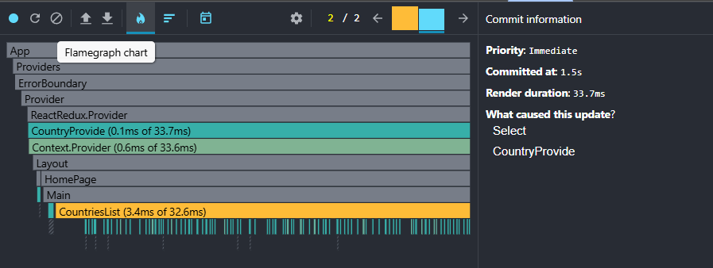
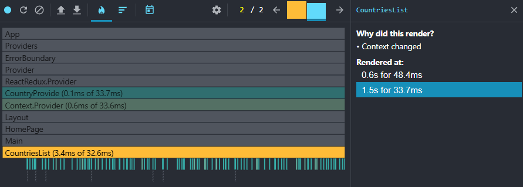
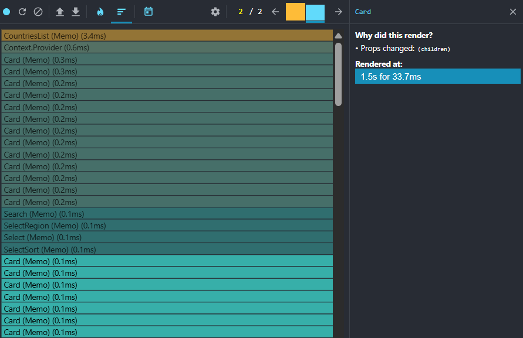

# React + TypeScript + Vite

## Before optimization (sort)

- Component CountriesList rendering duration - 3.3ms
- Context.Provider rendering duration - 1.1ms
- Components Card and Choose rendering from 0.1ms to 1.1ms
- Total rendering duration - 51.5ms

## After optimization (sort)

- Component CountriesList rendering duration - 3.4ms
- Context.Provider rendering duration - 0.6ms
- Components Card and Choose rendering from 0.1ms to 0.2ms
- Total rendering duration - 33.7ms

## Conclusion

Optimization reduced overall rendering time by **_14.4ms_** or **_~30%_**
